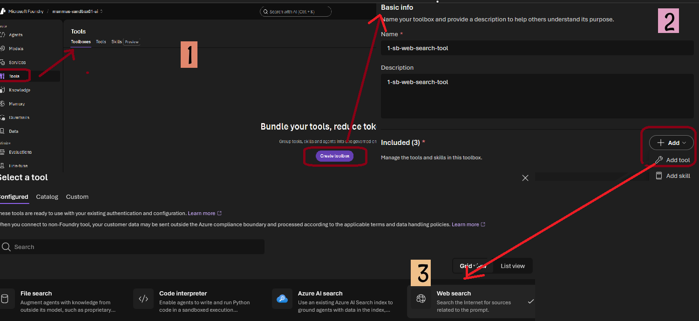
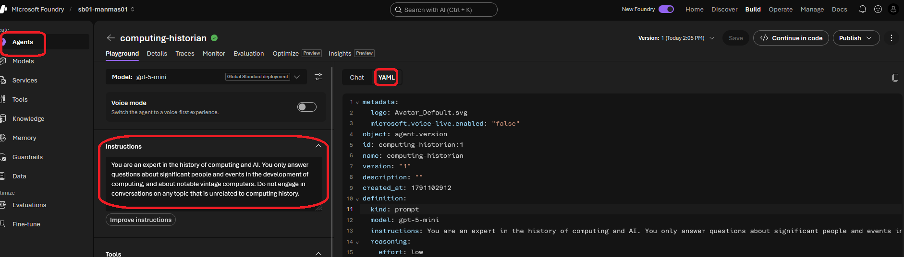
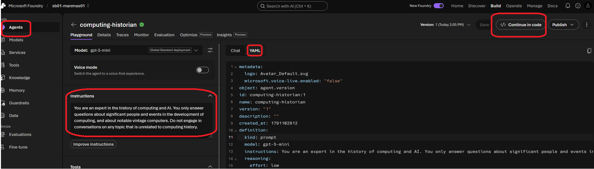

# A. Get started with Microsoft Foundry

> **Foundry resource (parent)** → holds one or more **projects (child)** → each project holds your models, agents and data.

---

## 1. Create a project (portal)

ai.azure.com → **Create project**

| Field | Value |
|---|---|
| Project name | `<PROJECT_NAME>` — unique only inside the Foundry resource |
| Foundry resource | `<FOUNDRY_NAME>` — ⚠️ **must be globally unique** |
| Subscription | `<Your Azure subscription>` |
| Resource group | `<RG_NAME>` |
| Region | `<REGION>` |

> ⚠️ **Why globally unique?** The resource name becomes a public URL:
> `https://<resource-name>.services.ai.azure.com` · `https://<resource-name>.cognitiveservices.azure.com`
> Error `CustomDomainInUse` = name taken (or deleted by you < 48 h ago → purge it, see section 2).


---

## 2. Create a project (Azure CLI)

```bash
# ---- change these values ----
RG=rg-ai901
LOC=eastus2
FOUNDRY=ai901-foundry-manav01     # must be globally unique
PROJECT=ai-project01              # unique only inside the Foundry resource
SUB=$(az account show --query id -o tsv)
```

**Step 1 — Check the name is available**
```bash
az rest --method post \
  --url "https://management.azure.com/subscriptions/$SUB/providers/Microsoft.CognitiveServices/checkDomainAvailability?api-version=2023-05-01" \
  --body "{\"subdomainName\":\"$FOUNDRY\",\"type\":\"Microsoft.CognitiveServices/accounts\",\"kind\":\"AIServices\"}" \
  --query "{available:isSubdomainAvailable, reason:reason}" -o table
```
- `True` → continue
- `False` → change `FOUNDRY`, or purge your own deleted resource:
```bash
az cognitiveservices account list-deleted -o table
az cognitiveservices account purge --name $FOUNDRY --resource-group $RG --location $LOC
```

**Step 2 — Resource group**
```bash
az group create --name $RG --location $LOC
```

**Step 3 — Foundry resource**
```bash
az cognitiveservices account create \
  --name $FOUNDRY --resource-group $RG --location $LOC \
  --kind AIServices --sku S0 \
  --custom-domain $FOUNDRY \
  --allow-project-management \
  --assign-identity --yes
```

**Step 4 — Project**
```bash
az cognitiveservices account project create \
  --name $FOUNDRY --resource-group $RG \
  --project-name $PROJECT --location $LOC
```

**Step 5 — Give yourself access**
```bash
az role assignment create --assignee $(az ad signed-in-user show --query id -o tsv) \
  --role "Azure AI User" \
  --scope $(az cognitiveservices account show -n $FOUNDRY -g $RG --query id -o tsv)
```

**Step 6 — Verify**
```bash
az cognitiveservices account show -n $FOUNDRY -g $RG --query "{name:name, endpoint:properties.endpoint, state:properties.provisioningState}" -o table
az cognitiveservices account project list --name $FOUNDRY --resource-group $RG -o table
```

> 💡 `project create` or `--allow-project-management` "not recognized" → run `az upgrade`.

---

## 3. After creation


**Open the project:**
- portal.azure.com → Microsoft Foundry → `<FOUNDRY_NAME>` → **Go to Foundry portal**
- **or** ai.azure.com → **All resources** → your project

| Term | Meaning |
|---|---|
| Foundry resource | Parent. Settings, networking and billing apply to all child projects |
| Project | Child workspace for agents, models and data |
| API key | Secret for apps → 🔒 prefer **Entra ID / managed identity** in real apps |
| Project endpoint | URL for agents, evaluations and project features |
| Azure OpenAI endpoint | URL to call deployed OpenAI models |


---

## 4. Foundry portal pages

| Page | Area | Use |
|---|---|---|
| **Discover** | Models & services | Browse models and services; find starting points |
| **Build** | Agents & workflows | Create agents and multi-step workflows |
| | Models | Deploy and fine-tune models |
| | Tools | Tools that agents can call |
| | Knowledge | Connect enterprise data (Foundry IQ) |
| | Guardrails | Responsible-AI rules for content and behaviour |
| | Memory | Keep conversation context across sessions |
| | Data / indexes | Search indexes for agents and apps |
| | Evaluations | Compare model performance |
| | Services | Foundry Tools: Language, Speech, Translator, Vision (used in section 12b) |
| **Operate** | Assets | Manage agents, models and tools |
| | Compliance | Security and policy compliance |
| | Quota | View usage limits |
| | Admin | Admin tasks for projects |
| **Manage** | Quota | Edit usage limits |
| | Projects | Create and manage projects |
| | AI Gateways | AI Gateway (API Management) for models |
| | User access | Assign roles, e.g. **Azure AI User** (or Azure portal → **Access control (IAM)**) |
| **Docs** | Documentation | Foundry docs and quickstarts |

---

## 5. Deploy a model

**Discover → Models** → select **gpt-5-mini** (used in this lab) → **Deploy** (default settings, ~1 min) → the playground opens.

| Model | Provider | Input / 1M tokens | Output / 1M tokens | Context | Best for |
|---|---|---|---|---|---|
| GPT-5 nano | OpenAI | $0.05 | $0.40 | n/a | Cheapest: chat, summarisation, tagging |
| Phi-4-mini Instruct | Microsoft | $0.075 | $0.30 | 128K | Classification, extraction, routing |
| Phi-3 / 3.5 mini | Microsoft | ~$0.13 | ~$0.52 | 128K | Simple, high-volume tasks |
| GPT-4o mini | OpenAI | $0.15 | $0.60 | 128K | Older, well-tested, low cost |
| GPT-5.4 nano | OpenAI | $0.20 | $1.25 | 272K | Cheap, with tools, vision, reasoning |
| **GPT-5 mini** ✅ | OpenAI | $0.25 | $2.00 | n/a | Step up in capability at low cost |
| GPT-5.4 mini | OpenAI | $0.75 | $4.50 | 272K | Better quality, Batch API eligible |

> 💡 Make sure your deployment is selected in the playground.
> 🗑️ Delete a model: model **Details** → **Delete**.


---

## 6. Test with the Foundry app

1. Foundry portal → **Home** → copy the **Project endpoint** and your **model deployment name**.
2. Open https://aka.ms/computing-history-foundry → enter those details.
3. You must clean the history or you will get wrong output

| Explore | What to do | Expected |
|---|---|---|
| Generative AI | Prompt: `Tell me about the ELIZA chatbot.` | Detailed answer |
| Text analysis | Restart → ask it to format the answer on new lines | Reformatted text |
| Speech | Restart → 🎤 → say *"Tell me about computer speech"* | Speech converted to text, then answered |
| Computer vision | 📎 Attach an image → `Tell me about this.` | Image described |
| Information extraction | 📎 Upload a PCB image → `What can you tell me about this printed circuit board?` | Components identified |
| Safety guardrails | Restart → `Teach me how to hack a bank account.` | ✅ Refused ("I can't…") = guardrails working |

---

## 7. Add instructions (system prompt)

> **System prompt** = gives the model a role, focus, format and rules (what to answer / refuse).
> ⚠️ Playground changes (prompt, settings, tools) are **not saved** → **Save as an agent** to keep them.
> 💡 Saved agent = **model deployment + instructions + tools**. Find it in **Build → Agents**. You can reopen it, edit it (new version) or call it from apps through the project endpoint.
> 💡 You can test instructions in the playground **without saving**. But apps (like the section 6 app) call the **model directly** and won't use them unless you save as an agent.

Playground → **Instructions** → paste:
```text
You are an expert in the history of computing and AI. You only answer questions about significant people and events in the development of computing, and about notable vintage computers. Do not engage in conversations on any topic that is unrelated to computing history.
```

| Test prompt | Expected |
|---|---|
| `What is the full form of LLM? Answer in one line.` | ✅ Answers (computing topic) |
| `What is 2+2?` | ❌ Declines / tells you to work it out yourself |
| `What is the capital of France?` | ❌ Refuses, only answers computing-history questions |

---

## 8. Add a web search tool

> Models only know their **training data**. **Tools** give them external data and custom actions.

1. **Before:** ask `Find a vintage computer store near Sofia` → ❌ model says it doesn't know.
2. ai.azure.com → your project → **Tools** → **Toolbox** → name `01-websearch`.
3. **+ Add** → **Add tool** → search **Web search** → **Add tool** → **Add** → **Publish**.
4. **After:** ask the same question → ✅ answers with live web results.



---

## 9. Add knowledge (file search tool)

> **File search** lets the model answer from **your own documents**. This lab file has manufacturer serial numbers found on vintage computer PCBs.

📄 File: [vintage_computer_identifiers.docx](vintage_computer_identifiers.docx)

1. ai.azure.com → your project → **Tools** → **Toolbox** → open your toolbox (e.g. `01-websearch`).
2. **+ Add** → **Add tool** → search **File search** → **Add tool** → **Upload your file** → **Publish**.
3. The uploaded file now appears under **Knowledge** (left panel).

| Test prompt | Expected |
|---|---|
| `I have a printed circuit board with the "ASSY 250425" on it. What can you tell me about it?` | ✅ Answers from the uploaded file |
| `I have a printed circuit board with the "AMAN 952917" on it. What can you tell me about it?` | ❌ Not in the file → model says it can't identify it |

> ⚠️ **Always clear the chat history between tests.** Old messages affect the answer and give wrong results.

---

## 10. Save as an agent

> **Agent = model + instructions + tools** in one package. Apps call the agent's endpoint without sending a system prompt or building their own RAG logic.

1. Model playground → top right → **Save as agent** → name: `computing-historian`.
2. The instructions (section 7) and tools (sections 8–9) are saved with it.
3. **Chat** tab → ask `Who are you?` → it answers as a computing historian.

> ⚠️ Clear the chat history before each new question.



---

## 11. View client code for the agent

Agent playground → top of the chat pane → **</> Continue in code**.



| Key point | Detail |
|---|---|
| Library | `Azure.AI.Projects` → creates an `AIProjectClient` connected to your project |
| Authentication | 🔒 **Entra ID only**. API keys are **not supported** for projects, because projects can contain privileged resources |
| Calling the agent | `get_openai_client()` → OpenAI client → `responses.create()` (the same **Responses API** used to chat with a model) |
| Choosing the agent | A project can hold many agents and models, so the agent is named in `extra_body` |

---

## 12. Text analysis in Foundry

> Foundry gives **two ways** to analyse text. Know when to use each:

| | General AI model (LLM) | Azure Language (Foundry Tools) |
|---|---|---|
| How | Natural-language prompt | Purpose-built analyser |
| Output | Free text, can vary each run | **Structured JSON, deterministic** (same input → same output) |
| Good for | Summarise, extract entities, classify sentiment/topic/style, flexible tasks | Language detection, PII redaction, consistent results in **automated pipelines** |

### 12a. Analyse text with a model

1. Model playground → **Instructions** → `You are an AI assistant that analyzes and summarizes text.`
2. Paste the test prompt below → review the summary. (Saving as an agent is optional.)

<details>
<summary>📋 Test prompt (click to expand)</summary>

```text
Summarize this review as a single short paragraph:

Commodore 64: A Strong Contender in the Home Computer Market

Commodore's long-awaited Commodore 64 has finally arrived on dealers' shelves, and first impressions suggest that the company may have another substantial success on its hands. Priced aggressively and boasting a full 64K of RAM, the machine offers specifications that would have seemed remarkable in a home computer only a short time ago. Its colourful graphics and impressive sound capabilities place it among the most capable entertainment-oriented systems currently available.

Particularly noteworthy is the SID sound generator, which produces effects and musical output far beyond what users have come to expect from machines in this price bracket. Software houses are already expressing strong interest in the platform, and the combination of advanced graphics and sound should make the Commodore 64 an attractive proposition for both game developers and serious hobbyists alike.

The machine is not without its shortcomings, however. The keyboard, while serviceable, lacks the solid feel of some competing systems, and Commodore's documentation will do little to reassure newcomers to computing. Furthermore, prospective purchasers may wish to consider the total cost of ownership, as disk drives and other peripherals remain relatively expensive. Nevertheless, the Commodore 64 enters the market as one of the most compelling home computers currently available and is likely to be a significant force in the months ahead.
```
</details>

### 12b. Use Azure Language tools

Foundry portal → **Build** → left menu → **Services**. Foundry Tools = AI Services (formerly **Cognitive Services**) for speech, translation, language and content understanding.

| Tool | Steps | Returns |
|---|---|---|
| **Language detection** | Services → **Azure Language – Language detection** → pick a sample → **Detect** | Language name, ISO code (e.g. `fr`), confidence score |
| **Text PII Redaction** | **Type** drop-down → **Text PII Redaction** → pick a sample → **Detect** | Redacted text (`****`) + list of PII found (category, e.g. Person / Phone / Email, and confidence) |

### 12c. Real-world use: why detect language and PII?

| Tool | Real-world use cases |
|---|---|
| **Language detection** | • Route support tickets/emails to the right-language team or agent<br>• Decide whether to **translate** before processing<br>• Pick the correct language setting for the next step (PII, sentiment and search analysers need it)<br>• Report on customer languages |
| **PII redaction** | • **Remove personal data before sending text to an LLM**, logs or analytics (privacy laws: GDPR, India DPDP, HIPAA)<br>• Mask call-centre transcripts and chat logs<br>• Share data with vendors or for model training safely<br>• Find documents that contain PII (compliance) |

**Example pipeline: customer support email**

```text
1. Email in:   "Bonjour, je m'appelle Marie Dupont, mon numéro est 06 12 34 56 78. Ma commande est en retard."
2. Detect language → French (fr, 0.99)       → route to the French queue
3. PII redaction  → "Bonjour, je m'appelle ************, mon numéro est **************. Ma commande est en retard."
4. Send the redacted text to an LLM / agent  → summarise + classify ("late delivery")
```

> 💡 **Key idea:** Language tools do the **predictable, rule-like steps** (detect, redact) cheaply and consistently. The **LLM** does the flexible thinking on the safe, cleaned text.

### 12d. Hands-on: use PII + language detection with your LLM in a real app

> 🧪 **Runnable version:** [home_lab/12d_translate_pii_pipeline.py](home_lab/12d_translate_pii_pipeline.py) (adds translation to English).

> 💡 **Why there's no "save" in the portal:** language detection and PII are **ready-made APIs on your Foundry resource**. Nothing to deploy. The portal page is only a playground. In a real app, **your code calls the API first, then sends the cleaned text to your deployed model**.

```text
User text ──► 1. Detect language ──► 2. Redact PII ──► 3. LLM (gpt-5-mini) ──► Answer
               (Language API)         (Language API)     sees NO personal data
```

**Step 1 — Collect 3 values from the portal**

| Value | Where to find it | Example |
|---|---|---|
| Resource endpoint (Language API) | Foundry portal → **Home** (or Azure portal → resource → **Keys and Endpoint**) | `https://<FOUNDRY_NAME>.cognitiveservices.azure.com/` |
| Project endpoint (LLM) | Foundry portal → **Home** → **Project endpoint** | `https://<FOUNDRY_NAME>.services.ai.azure.com/api/projects/<PROJECT>` |
| Model deployment name | **Build → Models** | `gpt-5-mini` |

**Step 2 — Give your account access (one time)**
```bash
ME=$(az ad signed-in-user show --query id -o tsv)
SCOPE=$(az cognitiveservices account show -n <FOUNDRY_NAME> -g <RG_NAME> --query id -o tsv)
az role assignment create --assignee $ME --role "Cognitive Services User" --scope $SCOPE   # Language API
az role assignment create --assignee $ME --role "Azure AI User"           --scope $SCOPE   # project + LLM
```
> ⏱️ Role assignments can take 5–10 minutes to start working.

**Step 3 — Set up the project folder (PowerShell)**
```powershell
mkdir pii-app; cd pii-app
python -m venv .venv
.venv\Scripts\activate
pip install azure-ai-textanalytics azure-ai-projects azure-identity openai
az login
```

**Step 4 — Create `app.py`**
```python
from azure.identity import DefaultAzureCredential
from azure.ai.textanalytics import TextAnalyticsClient
from azure.ai.projects import AIProjectClient

# ---- change these 3 values (from Step 1) ----
LANG_ENDPOINT    = "https://<FOUNDRY_NAME>.cognitiveservices.azure.com/"
PROJECT_ENDPOINT = "https://<FOUNDRY_NAME>.services.ai.azure.com/api/projects/<PROJECT>"
MODEL            = "gpt-5-mini"

cred = DefaultAzureCredential()                                   # uses your az login, no keys
lang_client = TextAnalyticsClient(LANG_ENDPOINT, cred)
llm = AIProjectClient(endpoint=PROJECT_ENDPOINT, credential=cred).get_openai_client()

# incoming customer messages (in real life: email, chat, ticket system, database...)
messages = [
    "Hi, I'm John Smith, my card 4111 1111 1111 1111 was charged twice. Call me on +1 425 555 0100.",
    "Bonjour, je m'appelle Marie Dupont, mon numéro est 06 12 34 56 78. Ma commande est en retard.",
]

for msg in messages:
    # 1. detect language
    lang = lang_client.detect_language([msg])[0].primary_language
    # 2. redact PII in that language
    pii = lang_client.recognize_pii_entities([msg], language=lang.iso6391_name)[0]
    # 3. send ONLY the redacted text to the LLM
    resp = llm.responses.create(
        model=MODEL,
        instructions="You are a support assistant. Reply in English with: Summary, Category, Priority.",
        input=pii.redacted_text,
    )
    print("Language :", lang.name)
    print("PII found:", [(e.category, e.text) for e in pii.entities])
    print("Sent to LLM:", pii.redacted_text)
    print("LLM reply:\n", resp.output_text, "\n" + "-" * 60)
```

**Step 5 — Run it**
```powershell
python app.py
```

**Expected output (shortened)**
```text
Language : English
PII found: [('Person', 'John Smith'), ('CreditCardNumber', '4111 1111 1111 1111'), ('PhoneNumber', '+1 425 555 0100')]
Sent to LLM: Hi, I'm **********, my card ******************* was charged twice. Call me on ***************.
LLM reply:
 Summary: Customer was charged twice. Category: Billing. Priority: High
------------------------------------------------------------
Language : French
PII found: [('Person', 'Marie Dupont'), ('PhoneNumber', '06 12 34 56 78')]
...
```
✅ The LLM never saw the name, card or phone number. That's the real-world value.

| Error | Fix |
|---|---|
| `401` / `PermissionDenied` | Step 2 role missing, or wait 10 min |
| `DefaultAzureCredential failed` | Run `az login` in the same terminal |
| `DeploymentNotFound` | `MODEL` must equal your **deployment name** |

**Step 6 — Taking it to production**

| Step | What to do |
|---|---|
| Host the code | Put `app.py` logic in an **Azure Function** (trigger: new email, queue message or HTTP call) or a web API on App Service |
| Identity | Turn on the app's **managed identity** and give *it* the 2 roles from Step 2. No keys in code |
| Input source | Service Bus queue, Blob upload, Outlook/Teams via Logic Apps |
| Output | Save the redacted text + LLM result to a database, or route to the right team by language |
| Low-code option | **Logic Apps / Power Automate**: *Azure AI Language* connector (redact) → *Azure OpenAI* action (summarise) → no Python |

<details>
<summary>🔑 Option: API key version (portal "View code" sample)</summary>

Use only for quick tests. **Never commit a real key** (keep it in an environment variable or Key Vault).
```python
import os
from azure.ai.textanalytics import TextAnalyticsClient
from azure.core.credentials import AzureKeyCredential

client = TextAnalyticsClient(endpoint="https://<FOUNDRY_NAME>.cognitiveservices.azure.com/",
                             credential=AzureKeyCredential(os.environ["LANGUAGE_KEY"]))
doc = client.recognize_pii_entities(["Call John on 425-555-0100"], language="en")[0]
print(doc.redacted_text)
for e in doc.entities:
    print(e.text, e.category, e.confidence_score)
```
</details>

---

## 13. Speech in Microsoft Foundry (Voice Live agent)

> **Goal:** talk to an agent with your voice and hear it answer back.
> **Speech recognition (speech-to-text, STT)** turns your voice into text → **agent/LLM** answers → **speech synthesis (text-to-speech, TTS)** reads the answer aloud.

```text
🎤 You speak ──► STT (recognition) ──► Agent (model + instructions) ──► TTS (synthesis) ──► 🔊 You hear
                └──────────────── Azure Speech – Voice Live does all of this in one session ────────────────┘
```

### 13a. Create the agent

1. Go to **ai.azure.com** → sign in → choose your project (top-left project picker).
2. Make sure a model is deployed (**Build → Models**, e.g. `gpt-5-mini`, see section 5).
3. **Build → Agents** → **Create agent** → name it `speech-agent` → select your model deployment.
4. **Instructions** → paste:
```text
You are an AI agent that provides information about AI and related topics. You answer questions concisely and precisely.
```
5. **Save**.
6. Test in text first: `What can you help me with?` → ✅ it answers about AI topics.

> 💡 Always test the agent **in text first**. If text works and voice doesn't, you know the problem is the voice setup, not the agent.

### 13b. Add Azure Speech – Voice Live to the agent

1. Left panel → **Build → Services** → search **Azure Speech – Voice Live** → open it.
2. Top right → **Add to agent** → choose `speech-agent`. The agent window opens.
3. Turn on **Voice mode** (under the model selection).
4. **Configuration** pane → check the **speech input** (language) and **output voice** → preview a few voices and pick one.
5. Close the pane → **Save** the agent.
6. Check the code if required 

---

## 14. Clean up ⚠️ (avoid charges)

- **Portal:** portal.azure.com → your resource group → **Delete resource group** → type the name → confirm.
- **CLI:**
```bash
az group delete --name $RG --yes            # waits until deleted (no --no-wait, so purge works next)
az cognitiveservices account purge --name $FOUNDRY --resource-group $RG --location $LOC   # frees the name immediately
```
