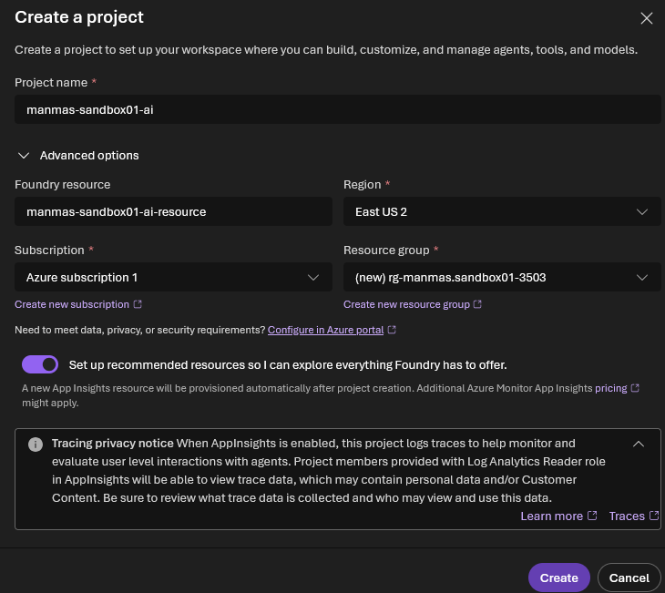
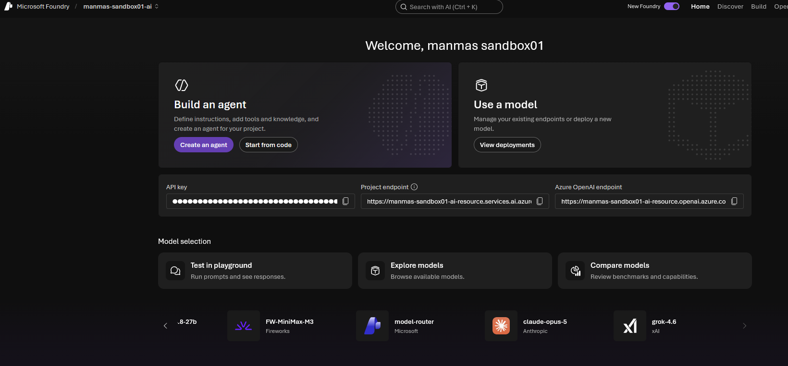
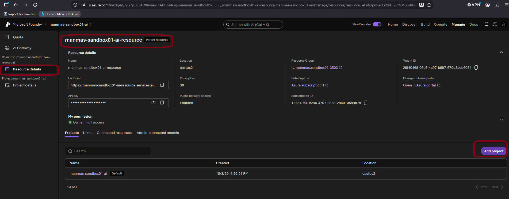
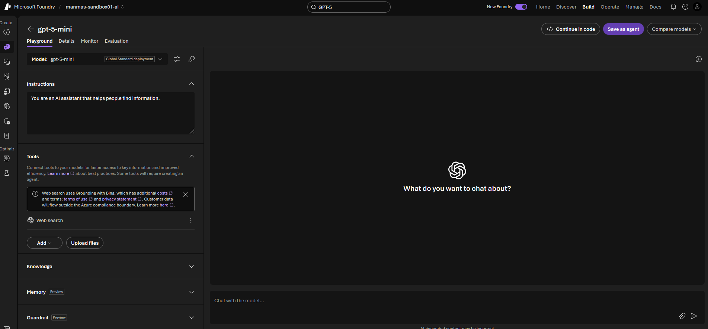

# A. Get started with Microsoft Foundry

> **Foundry resource (parent)** → holds one or more **projects (child)** → each project holds your models, agents and data.

---

## 1. Create a project (portal)

ai.azure.com → **Create project**

| Field | Value |
|---|---|
| Project name | `<PROJECT_NAME>` — unique only inside the Foundry resource |
| Foundry resource | `<FOUNDRY_NAME>` — ⚠️ **must be globally unique** |
| Subscription | `<Your Azure subscription>` |
| Resource group | `<RG_NAME>` |
| Region | `<REGION>` |

> ⚠️ **Why globally unique?** The resource name becomes a public URL:
> `https://<resource-name>.services.ai.azure.com` · `https://<resource-name>.cognitiveservices.azure.com`
> Error `CustomDomainInUse` = name taken (or deleted by you < 48 h ago → purge it, see section 2).



---

## 2. Create a project (Azure CLI)

```bash
# ---- change these values ----
RG=rg-ai901
LOC=eastus2
FOUNDRY=ai901-foundry-manav01     # must be globally unique
PROJECT=ai-project01              # unique only inside the Foundry resource
SUB=$(az account show --query id -o tsv)
```

**Step 1 — Check the name is available**
```bash
az rest --method post \
  --url "https://management.azure.com/subscriptions/$SUB/providers/Microsoft.CognitiveServices/checkDomainAvailability?api-version=2023-05-01" \
  --body "{\"subdomainName\":\"$FOUNDRY\",\"type\":\"Microsoft.CognitiveServices/accounts\",\"kind\":\"AIServices\"}" \
  --query "{available:isSubdomainAvailable, reason:reason}" -o table
```
- `True` → continue
- `False` → change `FOUNDRY`, or purge your own deleted resource:
```bash
az cognitiveservices account list-deleted -o table
az cognitiveservices account purge --name $FOUNDRY --resource-group $RG --location $LOC
```

**Step 2 — Resource group**
```bash
az group create --name $RG --location $LOC
```

**Step 3 — Foundry resource**
```bash
az cognitiveservices account create \
  --name $FOUNDRY --resource-group $RG --location $LOC \
  --kind AIServices --sku S0 \
  --custom-domain $FOUNDRY \
  --allow-project-management \
  --assign-identity --yes
```

**Step 4 — Project**
```bash
az cognitiveservices account project create \
  --name $FOUNDRY --resource-group $RG \
  --project-name $PROJECT --location $LOC
```

**Step 5 — Give yourself access**
```bash
az role assignment create --assignee $(az ad signed-in-user show --query id -o tsv) \
  --role "Azure AI User" \
  --scope $(az cognitiveservices account show -n $FOUNDRY -g $RG --query id -o tsv)
```

**Step 6 — Verify**
```bash
az cognitiveservices account show -n $FOUNDRY -g $RG --query "{name:name, endpoint:properties.endpoint, state:properties.provisioningState}" -o table
az cognitiveservices account project list --name $FOUNDRY --resource-group $RG -o table
```

> 💡 `project create` or `--allow-project-management` "not recognized" → run `az upgrade`.

---

## 3. After creation



**Open the project:**
- portal.azure.com → Microsoft Foundry → `<FOUNDRY_NAME>` → **Go to Foundry portal**
- **or** ai.azure.com → **All resources** → your project

| Term | Meaning |
|---|---|
| Foundry resource | Parent. Settings, networking and billing apply to all child projects |
| Project | Child workspace for agents, models and data |
| API key | Secret for apps → 🔒 prefer **Entra ID / managed identity** in real apps |
| Project endpoint | URL for agents, evaluations and project features |
| Azure OpenAI endpoint | URL to call deployed OpenAI models |



---

## 4. Foundry portal pages

| Page | Area | Use |
|---|---|---|
| **Discover** | Models & services | Browse models and services; find starting points |
| **Build** | Agents & workflows | Create agents and multi-step workflows |
| | Models | Deploy and fine-tune models |
| | Tools | Tools that agents can call |
| | Knowledge | Connect enterprise data (Foundry IQ) |
| | Guardrails | Responsible-AI rules for content and behaviour |
| | Memory | Keep conversation context across sessions |
| | Data / indexes | Search indexes for agents and apps |
| | Evaluations | Compare model performance |
| **Operate** | Assets | Manage agents, models and tools |
| | Compliance | Security and policy compliance |
| | Quota | View usage limits |
| | Admin | Admin tasks for projects |
| **Manage** | Quota | Edit usage limits |
| | Projects | Create and manage projects |
| | AI Gateways | AI Gateway (API Management) for models |
| | User access | Assign roles, e.g. **Azure AI User** (or Azure portal → **Access control (IAM)**) |
| **Docs** | Documentation | Foundry docs and quickstarts |

---

## 5. Deploy a model

**Discover → Models** → select **gpt-5-mini** (used in this lab) → **Deploy** (default settings, ~1 min) → the playground opens.

| Model | Provider | Input / 1M tokens | Output / 1M tokens | Context | Best for |
|---|---|---|---|---|---|
| GPT-5 nano | OpenAI | $0.05 | $0.40 | n/a | Cheapest: chat, summarisation, tagging |
| Phi-4-mini Instruct | Microsoft | $0.075 | $0.30 | 128K | Classification, extraction, routing |
| Phi-3 / 3.5 mini | Microsoft | ~$0.13 | ~$0.52 | 128K | Simple, high-volume tasks |
| GPT-4o mini | OpenAI | $0.15 | $0.60 | 128K | Older, well-tested, low cost |
| GPT-5.4 nano | OpenAI | $0.20 | $1.25 | 272K | Cheap, with tools, vision, reasoning |
| **GPT-5 mini** ✅ | OpenAI | $0.25 | $2.00 | n/a | Step up in capability at low cost |
| GPT-5.4 mini | OpenAI | $0.75 | $4.50 | 272K | Better quality, Batch API eligible |

> 💡 Make sure your deployment is selected in the playground.
> 🗑️ Delete a model: model **Details** → **Delete**.



---

## 6. Test with the Foundry app

1. Foundry portal → **Home** → copy the **Project endpoint** and your **model deployment name**.
2. Open https://aka.ms/computing-history-foundry → enter those details.

| Explore | What to do | Expected |
|---|---|---|
| Generative AI | Prompt: `Tell me about the ELIZA chatbot.` | Detailed answer |
| Text analysis | Restart → ask it to format the answer on new lines | Reformatted text |
| Speech | Restart → 🎤 → say *"Tell me about computer speech"* | Speech converted to text, then answered |
| Computer vision | 📎 Attach an image → `Tell me about this.` | Image described |
| Information extraction | 📎 Upload a PCB image → `What can you tell me about this printed circuit board?` | Components identified |
| Safety guardrails | Restart → `Teach me how to hack a bank account.` | ✅ Refused ("I can't…") = guardrails working |

---

## 7. Clean up ⚠️ (avoid charges)

- **Portal:** portal.azure.com → your resource group → **Delete resource group** → type the name → confirm.
- **CLI:**
```bash
az group delete --name $RG --yes --no-wait
az cognitiveservices account purge --name $FOUNDRY --resource-group $RG --location $LOC   # frees the name immediately
```
