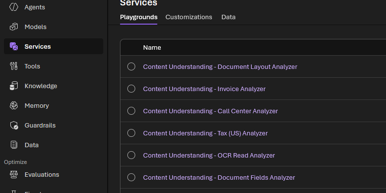
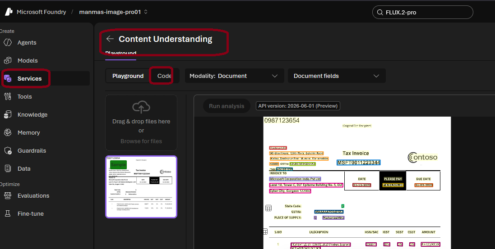

# A. Get started with Microsoft Foundry

> **Foundry resource (parent)** → holds one or more **projects (child)** → each project holds your models, agents and data.

---

## 1. Create a project (portal)

ai.azure.com → **Create project**

| Field | Value |
|---|---|
| Project name | `<PROJECT_NAME>` — unique only inside the Foundry resource |
| Foundry resource | `<FOUNDRY_NAME>` — ⚠️ **must be globally unique** |
| Subscription | `<Your Azure subscription>` |
| Resource group | `<RG_NAME>` |
| Region | `<REGION>` |

> ⚠️ **Why globally unique?** The resource name becomes a public URL:
> `https://<resource-name>.services.ai.azure.com` · `https://<resource-name>.cognitiveservices.azure.com`
> Error `CustomDomainInUse` = name taken (or deleted by you < 48 h ago → purge it, see section 2).


**🎯 Interview / revision**

| Question | Answer |
|---|---|
| What is Microsoft Foundry? | Azure's platform to build AI apps and agents: models, agents, tools, knowledge, evaluation and safety in one place (formerly Azure AI Foundry / Azure AI Studio). |
| Resource vs project? | **Resource** = parent (billing, networking, security, keys). **Project** = child workspace for one team/app (agents, deployments, data). |
| Why several projects under one resource? | Separate teams or apps, but share one bill, network setup and policies. |
| Which name must be globally unique? | The **Foundry resource** name, because it becomes the public endpoint URL. Project names only need to be unique inside the resource. |

---

## 2. Create a project (Azure CLI)

```bash
# ---- change these values ----
RG=rg-ai901
LOC=eastus2
FOUNDRY=ai901-foundry-manav01     # must be globally unique
PROJECT=ai-project01              # unique only inside the Foundry resource
SUB=$(az account show --query id -o tsv)
```

**Step 1 — Check the name is available**
```bash
az rest --method post \
  --url "https://management.azure.com/subscriptions/$SUB/providers/Microsoft.CognitiveServices/checkDomainAvailability?api-version=2023-05-01" \
  --body "{\"subdomainName\":\"$FOUNDRY\",\"type\":\"Microsoft.CognitiveServices/accounts\",\"kind\":\"AIServices\"}" \
  --query "{available:isSubdomainAvailable, reason:reason}" -o table
```
- `True` → continue
- `False` → change `FOUNDRY`, or purge your own deleted resource:
```bash
az cognitiveservices account list-deleted -o table
az cognitiveservices account purge --name $FOUNDRY --resource-group $RG --location $LOC
```

**Step 2 — Resource group**
```bash
az group create --name $RG --location $LOC
```

**Step 3 — Foundry resource**
```bash
az cognitiveservices account create \
  --name $FOUNDRY --resource-group $RG --location $LOC \
  --kind AIServices --sku S0 \
  --custom-domain $FOUNDRY \
  --allow-project-management \
  --assign-identity --yes
```

**Step 4 — Project**
```bash
az cognitiveservices account project create \
  --name $FOUNDRY --resource-group $RG \
  --project-name $PROJECT --location $LOC
```

**Step 5 — Give yourself access**
```bash
az role assignment create --assignee $(az ad signed-in-user show --query id -o tsv) \
  --role "Azure AI User" \
  --scope $(az cognitiveservices account show -n $FOUNDRY -g $RG --query id -o tsv)
```

**Step 6 — Verify**
```bash
az cognitiveservices account show -n $FOUNDRY -g $RG --query "{name:name, endpoint:properties.endpoint, state:properties.provisioningState}" -o table
az cognitiveservices account project list --name $FOUNDRY --resource-group $RG -o table
```

> 💡 `project create` or `--allow-project-management` "not recognized" → run `az upgrade`.

**🎯 Interview / revision**

| Question | Answer |
|---|---|
| `--kind AIServices`? | Creates a **Foundry (multi-service) resource**: OpenAI models + Speech, Language, Vision, Content Understanding behind one endpoint. |
| Why `--custom-domain`? | Gives the resource its own subdomain. **Required for Entra ID (token) authentication.** |
| Why `--assign-identity`? | Creates a **managed identity** so the resource can reach other Azure services (Storage, AI Search) without keys. |
| What is soft delete / purge? | A deleted resource is kept for **48 h** and still holds its name. **Purge** removes it for good so the name can be reused. |
| Which role lets you use the project? | **Azure AI User** (build and use agents/models). **Azure AI Owner / Account Owner** manage the resource. |

---

## 3. After creation


**Open the project:**
- portal.azure.com → Microsoft Foundry → `<FOUNDRY_NAME>` → **Go to Foundry portal**
- **or** ai.azure.com → **All resources** → your project

| Term | Meaning |
|---|---|
| Foundry resource | Parent. Settings, networking and billing apply to all child projects |
| Project | Child workspace for agents, models and data |
| API key | Secret for apps → 🔒 prefer **Entra ID / managed identity** in real apps |
| Project endpoint | URL for agents, evaluations and project features |
| Azure OpenAI endpoint | URL to call deployed OpenAI models |


**🎯 Interview / revision**

| Question | Answer |
|---|---|
| Key vs Entra ID? | **Key** = shared secret, anyone who has it gets in, must be rotated. **Entra ID** = per-user / per-app identity, role-based, can be audited. Prefer Entra ID. |
| What is a managed identity? | An Entra ID identity Azure gives your app (Function, App Service, VM). The app gets tokens automatically, **no secrets in code**. |
| Project endpoint vs OpenAI endpoint? | **Project endpoint** → agents, evaluations, project features. **OpenAI endpoint** → call a deployed model directly. |

---

## 4. Foundry portal pages

| Page | Area | Use |
|---|---|---|
| **Discover** | Models & services | Browse models and services; find starting points |
| **Build** | Agents & workflows | Create agents and multi-step workflows |
| | Models | Deploy and fine-tune models |
| | Tools | Tools that agents can call |
| | Knowledge | Connect enterprise data (Foundry IQ) |
| | Guardrails | Responsible-AI rules for content and behaviour |
| | Memory | Keep conversation context across sessions |
| | Data / indexes | Search indexes for agents and apps |
| | Evaluations | Compare model performance |
| | Services | Foundry Tools: Language, Speech, Translator, Vision (used in section 12b) |
| **Operate** | Assets | Manage agents, models and tools |
| | Compliance | Security and policy compliance |
| | Quota | View usage limits |
| | Admin | Admin tasks for projects |
| **Manage** | Quota | Edit usage limits |
| | Projects | Create and manage projects |
| | AI Gateways | AI Gateway (API Management) for models |
| | User access | Assign roles, e.g. **Azure AI User** (or Azure portal → **Access control (IAM)**) |
| **Docs** | Documentation | Foundry docs and quickstarts |

> 💡 Easy way to remember: **Discover** (find) → **Build** (create) → **Operate** (run and govern) → **Manage** (admin).

---

## 5. Deploy a model

**Discover → Models** → select **gpt-5-mini** (used in this lab) → **Deploy** (default settings, ~1 min) → the playground opens.

| Model | Provider | Input / 1M tokens | Output / 1M tokens | Context | Best for |
|---|---|---|---|---|---|
| GPT-5 nano | OpenAI | $0.05 | $0.40 | n/a | Cheapest: chat, summarisation, tagging |
| Phi-4-mini Instruct | Microsoft | $0.075 | $0.30 | 128K | Classification, extraction, routing |
| Phi-3 / 3.5 mini | Microsoft | ~$0.13 | ~$0.52 | 128K | Simple, high-volume tasks |
| GPT-4o mini | OpenAI | $0.15 | $0.60 | 128K | Older, well-tested, low cost |
| GPT-5.4 nano | OpenAI | $0.20 | $1.25 | 272K | Cheap, with tools, vision, reasoning |
| **GPT-5 mini** ✅ | OpenAI | $0.25 | $2.00 | n/a | Step up in capability at low cost |
| GPT-5.4 mini | OpenAI | $0.75 | $4.50 | 272K | Better quality, Batch API eligible |

> 💡 Make sure your deployment is selected in the playground.
> 🗑️ Delete a model: model **Details** → **Delete**.
> 💰 Prices change often. Check the model card in **Discover → Models** before you deploy.


**🎯 Interview / revision**

| Question | Answer |
|---|---|
| Model vs deployment? | **Model** = the AI in the catalog (e.g. gpt-5-mini). **Deployment** = your named, running copy of it. Code calls the **deployment name**, not the model name. |
| What is a token? | A piece of a word (~4 characters in English). You pay per **input** and **output** token. Output costs more. |
| What is the context window? | The maximum number of tokens (prompt + history + answer) the model can handle in one request. |
| How to choose a model? | Balance **quality vs cost vs speed**. Use a small model (nano/mini/Phi) for simple, high-volume tasks, and a larger one for reasoning. |
| Deployment types? | **Standard** (pay per token, one region), **Global** (Microsoft routes to any region, more capacity), **Provisioned (PTU)** (reserved capacity, steady latency), **Batch** (cheaper, not real-time). |

---

## 6. Test with the Foundry app

1. Foundry portal → **Home** → copy the **Project endpoint** and your **model deployment name**.
2. Open https://aka.ms/computing-history-foundry → enter those details.
3. You must clean the history or you will get wrong output

| Explore | What to do | Expected |
|---|---|---|
| Generative AI | Prompt: `Tell me about the ELIZA chatbot.` | Detailed answer |
| Text analysis | Restart → ask it to format the answer on new lines | Reformatted text |
| Speech | Restart → 🎤 → say *"Tell me about computer speech"* | Speech converted to text, then answered |
| Computer vision | 📎 Attach an image → `Tell me about this.` | Image described |
| Information extraction | 📎 Upload a PCB image → `What can you tell me about this printed circuit board?` | Components identified |
| Safety guardrails | Restart → `Teach me how to hack a bank account.` | ✅ Refused ("I can't…") = guardrails working |

**🎯 Interview / revision: the 6 AI workloads (exam favourite)**

| Workload | What it does | Example |
|---|---|---|
| Generative AI | Creates new text, code, images | Chatbot answers, drafting emails |
| Text analysis (NLP) | Understands text: language, sentiment, entities, PII, summary | Route support tickets |
| Speech | Speech-to-text and text-to-speech | Voice assistants, captions |
| Computer vision | Understands images and video | Describe a photo, detect objects |
| Information extraction | Pulls structured fields out of documents | Read invoices / receipts into JSON |
| Responsible AI / safety | Blocks harmful content | Refuse "hack a bank account" |

---

## 7. Add instructions (system prompt)

> **System prompt** = gives the model a role, focus, format and rules (what to answer / refuse).
> ⚠️ Playground changes (prompt, settings, tools) are **not saved** → **Save as an agent** to keep them.
> 💡 Saved agent = **model deployment + instructions + tools**. Find it in **Build → Agents**. You can reopen it, edit it (new version) or call it from apps through the project endpoint.
> 💡 You can test instructions in the playground **without saving**. But apps (like the section 6 app) call the **model directly** and won't use them unless you save as an agent.

Playground → **Instructions** → paste:
```text
You are an expert in the history of computing and AI. You only answer questions about significant people and events in the development of computing, and about notable vintage computers. Do not engage in conversations on any topic that is unrelated to computing history.
```

| Test prompt | Expected |
|---|---|
| `What is the full form of LLM? Answer in one line.` | ✅ Answers (computing topic) |
| `What is 2+2?` | ❌ Declines / tells you to work it out yourself |
| `What is the capital of France?` | ❌ Refuses, only answers computing-history questions |

**🎯 Interview / revision**

| Question | Answer |
|---|---|
| System prompt vs user prompt? | **System prompt (instructions)** = set by the developer, same for every chat (role, rules, format). **User prompt** = the question each user types. |
| Is a system prompt a security control? | **No.** It guides behaviour but can be bypassed (prompt injection). Use **guardrails / content filters** for real safety. |
| Other settings that change output? | **Temperature** (higher = more creative/random, lower = more focused), **max tokens** (answer length). Some reasoning models (GPT-5 family) don't use temperature and use **reasoning effort** instead. |
| What is prompt engineering? | Writing clear instructions, examples (**few-shot**) and format rules to get better answers without retraining the model. |

---

## 8. Add a web search tool

> Models only know their **training data**. **Tools** give them external data and custom actions.

1. **Before:** ask `Find a vintage computer store near Sofia` → ❌ model says it doesn't know.
2. ai.azure.com → your project → **Tools** → **Toolbox** → name `01-websearch`.
3. **+ Add** → **Add tool** → search **Web search** → **Add tool** → **Add** → **Publish**.
4. **After:** ask the same question → ✅ answers with live web results.


**🎯 Interview / revision**

| Question | Answer |
|---|---|
| Why does a model need tools? | Its knowledge stops at its **training cut-off**, and it can't act. Tools give it **live data** (web search) or **actions** (call an API, run code). |
| Who decides when to call a tool? | **The model.** It reads the question and chooses whether to use a tool. That is what makes it agent-like. |
| What is a toolbox? | A reusable, published set of tools in the project. You can attach it to models/agents instead of adding tools one by one. |
| Risk of web search? | Answers depend on web content (may be wrong). The model should **cite sources** so users can check. |

---

## 9. Add knowledge (file search tool)

> **File search** lets the model answer from **your own documents**. This lab file has manufacturer serial numbers found on vintage computer PCBs.

📄 File: [vintage_computer_identifiers.docx](vintage_computer_identifiers.docx)

1. ai.azure.com → your project → **Tools** → **Toolbox** → open your toolbox (e.g. `01-websearch`).
2. **+ Add** → **Add tool** → search **File search** → **Add tool** → **Upload your file** → **Publish**.
3. The uploaded file now appears under **Knowledge** (left panel).

| Test prompt | Expected |
|---|---|
| `I have a printed circuit board with the "ASSY 250425" on it. What can you tell me about it?` | ✅ Answers from the uploaded file |
| `I have a printed circuit board with the "AMAN 952917" on it. What can you tell me about it?` | ❌ Not in the file → model says it can't identify it |

> ⚠️ **Always clear the chat history between tests.** Old messages affect the answer and give wrong results.

**🎯 Interview / revision**

| Question | Answer |
|---|---|
| What is RAG? | **Retrieval-Augmented Generation**: find the relevant parts of your documents → add them to the prompt → model answers from them. File search does this for you. |
| How does file search find the right text? | The file is split into **chunks** → each chunk becomes an **embedding** (a vector of numbers for its meaning) → stored in a **vector store** → the question is matched by meaning (**semantic search**). |
| RAG vs fine-tuning? | **RAG** = give the model facts at question time (easy to update, cites sources). **Fine-tuning** = retrain the model to change its style/behaviour. For company facts, use RAG. |
| Why did "AMAN 952917" fail? | It's not in the file. Being grounded means the model says "I don't know" instead of **hallucinating** (making things up). |

---

## 10. Save as an agent

> **Agent = model + instructions + tools** in one package. Apps call the agent's endpoint without sending a system prompt or building their own RAG logic.

1. Model playground → top right → **Save as agent** → name: `computing-historian`.
2. The instructions (section 7) and tools (sections 8–9) are saved with it.
3. **Chat** tab → ask `Who are you?` → it answers as a computing historian.

> ⚠️ Clear the chat history before each new question.


**🎯 Interview / revision**

| Question | Answer |
|---|---|
| Model vs agent? | **Model** = only generates text. **Agent** = model + instructions + tools, can **decide** which tool to use and take steps to reach a goal. |
| Agent vs pipeline? | **Agent**: the model chooses the steps. **Pipeline**: your code fixes the steps (see 12d). Use a pipeline when the order must be guaranteed (e.g. redact PII **before** the LLM). |
| What happens when you edit a saved agent? | A **new version** is saved. Apps keep calling it by name. |
| Single agent vs multi-agent? | One agent does everything, or several specialised agents work together (e.g. one researches, one writes) in a **workflow**. |

---

## 11. View client code for the agent

Agent playground → top of the chat pane → **</> Continue in code**.


| Key point | Detail |
|---|---|
| Library | `azure-ai-projects` (Python) / `Azure.AI.Projects` (.NET) → creates an `AIProjectClient` connected to your project |
| Authentication | 🔒 **Entra ID only**. API keys are **not supported** for projects, because projects can contain privileged resources |
| Calling the agent | `get_openai_client()` → OpenAI client → `responses.create()` (the same **Responses API** used to chat with a model) |
| Choosing the agent | A project can hold many agents and models, so the agent is named in `extra_body` |

**🎯 Interview / revision**

| Question | Answer |
|---|---|
| What is the Responses API? | OpenAI's API for chatting with a model or agent. One call can include text, images and tool use. Replaces the older Chat Completions style. |
| What is `DefaultAzureCredential`? | Tries several sign-in methods in order (env vars → managed identity → `az login` …). Same code works on your laptop and in Azure. |
| Why no API key for agents? | Projects can reach privileged resources (data, tools), so Microsoft requires **Entra ID** to control and audit who calls them. |

---

## 12. Text analysis in Foundry

> Foundry gives **two ways** to analyse text. Know when to use each:

| | General AI model (LLM) | Azure Language (Foundry Tools) |
|---|---|---|
| How | Natural-language prompt | Purpose-built analyser |
| Output | Free text, can vary each run | **Structured JSON, deterministic** (same input → same output) |
| Good for | Summarise, extract entities, classify sentiment/topic/style, flexible tasks | Language detection, PII redaction, consistent results in **automated pipelines** |

### 12a. Analyse text with a model

1. Model playground → **Instructions** → `You are an AI assistant that analyzes and summarizes text.`
2. Paste the test prompt below → review the summary. (Saving as an agent is optional.)

<details>
<summary>📋 Test prompt (click to expand)</summary>

```text
Summarize this review as a single short paragraph:

Commodore 64: A Strong Contender in the Home Computer Market

Commodore's long-awaited Commodore 64 has finally arrived on dealers' shelves, and first impressions suggest that the company may have another substantial success on its hands. Priced aggressively and boasting a full 64K of RAM, the machine offers specifications that would have seemed remarkable in a home computer only a short time ago. Its colourful graphics and impressive sound capabilities place it among the most capable entertainment-oriented systems currently available.

Particularly noteworthy is the SID sound generator, which produces effects and musical output far beyond what users have come to expect from machines in this price bracket. Software houses are already expressing strong interest in the platform, and the combination of advanced graphics and sound should make the Commodore 64 an attractive proposition for both game developers and serious hobbyists alike.

The machine is not without its shortcomings, however. The keyboard, while serviceable, lacks the solid feel of some competing systems, and Commodore's documentation will do little to reassure newcomers to computing. Furthermore, prospective purchasers may wish to consider the total cost of ownership, as disk drives and other peripherals remain relatively expensive. Nevertheless, the Commodore 64 enters the market as one of the most compelling home computers currently available and is likely to be a significant force in the months ahead.
```
</details>

### 12b. Use Azure Language tools

Foundry portal → **Build** → left menu → **Services**. Foundry Tools = AI Services (formerly **Cognitive Services**) for speech, translation, language and content understanding.

| Tool | Steps | Returns |
|---|---|---|
| **Language detection** | Services → **"Azure Language – Language detection"** → pick a sample → **Detect** | Language name, ISO code (e.g. `fr`), confidence score |
| **Text PII Redaction** | **Type** drop-down → **"Text PII Redaction"** → pick a sample → **Detect** | Redacted text (`****`) + list of PII found (category, e.g. Person / Phone / Email, and confidence) |

### 12c. Real-world use: why detect language and PII?

| Tool | Real-world use cases |
|---|---|
| **Language detection** | • Route support tickets/emails to the right-language team or agent<br>• Decide whether to **translate** before processing<br>• Pick the correct language setting for the next step (PII, sentiment and search analysers need it)<br>• Report on customer languages |
| **PII redaction** | • **Remove personal data before sending text to an LLM**, logs or analytics (privacy laws: GDPR, India DPDP, HIPAA)<br>• Mask call-centre transcripts and chat logs<br>• Share data with vendors or for model training safely<br>• Find documents that contain PII (compliance) |

**Example pipeline: customer support email**

```text
1. Email in:   "Bonjour, je m'appelle Marie Dupont, mon numéro est 06 12 34 56 78. Ma commande est en retard."
2. Detect language → French (fr, 0.99)       → route to the French queue
3. PII redaction  → "Bonjour, je m'appelle ************, mon numéro est **************. Ma commande est en retard."
4. Send the redacted text to an LLM / agent  → summarise + classify ("late delivery")
```

> 💡 **Key idea:** Language tools do the **predictable, rule-like steps** (detect, redact) cheaply and consistently. The **LLM** does the flexible thinking on the safe, cleaned text.

### 12d. Hands-on: use PII + language detection with your LLM in a real app

> 🧪 **Runnable version:** [home_lab/12d_translate_pii_pipeline.py](home_lab/12d_translate_pii_pipeline.py) (adds translation to English).

> 💡 **Why there's no "save" in the portal:** language detection and PII are **ready-made APIs on your Foundry resource**. Nothing to deploy. The portal page is only a playground. In a real app, **your code calls the API first, then sends the cleaned text to your deployed model**.

```text
User text ──► 1. Detect language ──► 2. Redact PII ──► 3. LLM (gpt-5-mini) ──► Answer
               (Language API)         (Language API)     sees NO personal data
```

**Step 1 — Collect 3 values from the portal**

| Value | Where to find it | Example |
|---|---|---|
| Resource endpoint (Language API) | Foundry portal → **Home** (or Azure portal → resource → **Keys and Endpoint**) | `https://<FOUNDRY_NAME>.cognitiveservices.azure.com/` |
| Project endpoint (LLM) | Foundry portal → **Home** → **Project endpoint** | `https://<FOUNDRY_NAME>.services.ai.azure.com/api/projects/<PROJECT>` |
| Model deployment name | **Build → Models** | `gpt-5-mini` |

**Step 2 — Give your account access (one time)**
```bash
ME=$(az ad signed-in-user show --query id -o tsv)
SCOPE=$(az cognitiveservices account show -n <FOUNDRY_NAME> -g <RG_NAME> --query id -o tsv)
az role assignment create --assignee $ME --role "Cognitive Services User" --scope $SCOPE   # Language API
az role assignment create --assignee $ME --role "Azure AI User"           --scope $SCOPE   # project + LLM
```
> ⏱️ Role assignments can take 5–10 minutes to start working.

**Step 3 — Set up the project folder (PowerShell)**
```powershell
mkdir pii-app; cd pii-app
python -m venv .venv
.venv\Scripts\activate
pip install azure-ai-textanalytics azure-ai-projects azure-identity openai
az login
```

**Step 4 — Create `app.py`**
```python
from azure.identity import DefaultAzureCredential
from azure.ai.textanalytics import TextAnalyticsClient
from azure.ai.projects import AIProjectClient

# ---- change these 3 values (from Step 1) ----
LANG_ENDPOINT    = "https://<FOUNDRY_NAME>.cognitiveservices.azure.com/"
PROJECT_ENDPOINT = "https://<FOUNDRY_NAME>.services.ai.azure.com/api/projects/<PROJECT>"
MODEL            = "gpt-5-mini"

cred = DefaultAzureCredential()                                   # uses your az login, no keys
lang_client = TextAnalyticsClient(LANG_ENDPOINT, cred)
llm = AIProjectClient(endpoint=PROJECT_ENDPOINT, credential=cred).get_openai_client()

# incoming customer messages (in real life: email, chat, ticket system, database...)
messages = [
    "Hi, I'm John Smith, my card 4111 1111 1111 1111 was charged twice. Call me on +1 425 555 0100.",
    "Bonjour, je m'appelle Marie Dupont, mon numéro est 06 12 34 56 78. Ma commande est en retard.",
]

for msg in messages:
    # 1. detect language
    lang = lang_client.detect_language([msg])[0].primary_language
    # 2. redact PII in that language
    pii = lang_client.recognize_pii_entities([msg], language=lang.iso6391_name)[0]
    # 3. send ONLY the redacted text to the LLM
    resp = llm.responses.create(
        model=MODEL,
        instructions="You are a support assistant. Reply in English with: Summary, Category, Priority.",
        input=pii.redacted_text,
    )
    print("Language :", lang.name)
    print("PII found:", [(e.category, e.text) for e in pii.entities])
    print("Sent to LLM:", pii.redacted_text)
    print("LLM reply:\n", resp.output_text, "\n" + "-" * 60)
```

**Step 5 — Run it**
```powershell
python app.py
```

**Expected output (shortened)**
```text
Language : English
PII found: [('Person', 'John Smith'), ('CreditCardNumber', '4111 1111 1111 1111'), ('PhoneNumber', '+1 425 555 0100')]
Sent to LLM: Hi, I'm **********, my card ******************* was charged twice. Call me on ***************.
LLM reply:
 Summary: Customer was charged twice. Category: Billing. Priority: High
------------------------------------------------------------
Language : French
PII found: [('Person', 'Marie Dupont'), ('PhoneNumber', '06 12 34 56 78')]
...
```
✅ The LLM never saw the name, card or phone number. That's the real-world value.

| Error | Fix |
|---|---|
| `401` / `PermissionDenied` | Step 2 role missing, or wait 10 min |
| `DefaultAzureCredential failed` | Run `az login` in the same terminal |
| `DeploymentNotFound` | `MODEL` must equal your **deployment name** |

**Step 6 — Taking it to production**

| Step | What to do |
|---|---|
| Host the code | Put `app.py` logic in an **Azure Function** (trigger: new email, queue message or HTTP call) or a web API on App Service |
| Identity | Turn on the app's **managed identity** and give *it* the 2 roles from Step 2. No keys in code |
| Input source | Service Bus queue, Blob upload, Outlook/Teams via Logic Apps |
| Output | Save the redacted text + LLM result to a database, or route to the right team by language |
| Low-code option | **Logic Apps / Power Automate**: *Azure AI Language* connector (redact) → *Azure OpenAI* action (summarise) → no Python |

<details>
<summary>🔑 Option: API key version (portal "View code" sample)</summary>

Use only for quick tests. **Never commit a real key** (keep it in an environment variable or Key Vault).
```python
import os
from azure.ai.textanalytics import TextAnalyticsClient
from azure.core.credentials import AzureKeyCredential

client = TextAnalyticsClient(endpoint="https://<FOUNDRY_NAME>.cognitiveservices.azure.com/",
                             credential=AzureKeyCredential(os.environ["LANGUAGE_KEY"]))
doc = client.recognize_pii_entities(["Call John on 425-555-0100"], language="en")[0]
print(doc.redacted_text)
for e in doc.entities:
    print(e.text, e.category, e.confidence_score)
```
</details>

**🎯 Interview / revision**

| Question | Answer |
|---|---|
| What can Azure Language do? | Language detection, **sentiment analysis**, **key phrase extraction**, **named entity recognition (NER)**, **PII detection/redaction**, summarization, conversational language understanding (CLU), question answering. |
| Entity vs PII? | **Entity** = any named thing (person, place, date, product). **PII** = entities that identify a person (name, phone, email, card number). |
| When to use Azure Language instead of an LLM? | You need **the same output every time**, structured JSON, low cost, or a compliance step (PII) that must run **before** the LLM. |
| What is a confidence score? | 0–1 value showing how sure the service is. Use a threshold (e.g. < 0.8 → human review). |
| Why redact before the LLM? | So personal data is never sent to, logged by, or stored with the model. That supports privacy laws (GDPR / DPDP / HIPAA). |

---

## 13. Speech in Microsoft Foundry (Voice Live agent)

> **Goal:** talk to an agent with your voice and hear it answer back.
> **Speech recognition (speech-to-text, STT)** turns your voice into text → **agent/LLM** answers → **speech synthesis (text-to-speech, TTS)** reads the answer aloud.

```text
🎤 You speak ──► STT (recognition) ──► Agent (model + instructions) ──► TTS (synthesis) ──► 🔊 You hear
                └──────────────── Azure Speech – Voice Live does all of this in one session ────────────────┘
```

### 13a. Create the agent

1. Go to **ai.azure.com** → sign in → choose your project (top-left project picker).
2. Make sure a model is deployed (**Build → Models**, e.g. `gpt-5-mini`, see section 5).
3. **Build → Agents** → **Create agent** → name it `speech-agent` → select your model deployment.
4. **Instructions** → paste:
```text
You are an AI agent that provides information about AI and related topics. You answer questions concisely and precisely.
```
5. **Save**.
6. Test in text first: `What can you help me with?` → ✅ it answers about AI topics.

> 💡 Always test the agent **in text first**. If text works and voice doesn't, you know the problem is the voice setup, not the agent.

### 13b. Add Azure Speech – Voice Live to the agent

1. Left panel → **Build → Services** → search **Azure Speech – Voice Live** → open it.
2. Top right → **Add to agent** → choose `speech-agent`. The agent window opens.
3. Turn on **Voice mode** (under the model selection).
4. **Configuration** pane → check the **speech input** (language) and **output voice** → preview a few voices and pick one.
5. Close the pane → **Save** the agent.
6. (Optional) check the client code, see 13d.

### 13c. Talk to the agent (validation)

1. **Chat** pane → **Start session** → allow microphone access in the browser.
2. When the status shows **Listening…**, say: *"How does speech recognition work?"*
3. Ask a second question: *"How does speech synthesis work?"* (the session keeps listening).
4. Select **cc** (bottom of the chat) to see the text of what you said and the reply.
5. Select **X** to end the session → the full **transcript** is shown.

| Check | Expected |
|---|---|
| Status after you speak | **Listening… → Processing… → Speaking…** (Processing can be too fast to see) |
| You hear a spoken reply | ✅ TTS (speech synthesis) works |
| **cc** shows your words correctly | ✅ STT (speech recognition) works |
| Reply is short and about AI | ✅ Agent instructions are followed |

> 🎤 Stuck on **Listening…** → browser blocked the mic → click 🔒 in the address bar → allow **Microphone**.

### 13d. View client code

Agent window → **</> Continue in code** (some portal versions show **Call agent**). The sample handles the live connection (WebSocket), audio streaming in/out and microphone/speaker selection, with Entra ID auth.

### 13e. 🎯 Interview / revision

| Question | Answer |
|---|---|
| Speech recognition vs speech synthesis? | **Recognition = STT** (voice → text). **Synthesis = TTS** (text → voice). |
| What is Voice Live? | A Foundry speech service that runs **STT + model + TTS in one real-time session**, so you don't build that pipeline yourself. |
| What extras does Voice Live handle? | **Noise suppression**, **echo cancellation**, **end-of-turn detection**, **interruption (barge-in)**, choice of **neural voices**. |
| Did the agent change when voice was added? | **No.** Same model + instructions + tools. Voice is only a new input/output. |
| What is SSML? | Speech Synthesis Markup Language: controls rate, pitch, pauses and pronunciation of a TTS voice. |
| Other Azure Speech features? | Real-time and **batch transcription**, **speech translation**, **custom speech** (your vocabulary/accent), **custom neural voice**, **pronunciation assessment**. |

---

## 14. Computer vision in Microsoft Foundry

> Two different jobs:
> - **Analyse an image** (image in → text out): a **multimodal** chat model like `gpt-5-mini` can do this.
> - **Generate an image** (text in → image out): needs a separate **text-to-image** model. `gpt-5-mini` can **read** images but **can't create** them.

📦 Sample images: [images.zip](images.zip) (or [download](https://microsoftlearning.github.io/mslearn-ai-fundamentals/data/images.zip)) → extract it (`image_01.png` … `image_03.png`).

### 14a. Analyse images with gpt-5-mini

1. ai.azure.com → your project → **Build → Models** → open `gpt-5-mini` (deployed in section 5) → playground.
2. **Instructions** → paste:
```text
You are an AI assistant that helps people identify vintage computer hardware.
```
3. Chat pane → **Upload image** → pick `image_01.png` → prompt `What can you tell me about this?`
4. Clear the chat → repeat with the other images and prompts like `What is this?` / `Tell me about this.`
5. (Optional) **Save as agent** if you want to reuse it.

| Check | Expected |
|---|---|
| Answer about the uploaded image | ✅ Names/describes the vintage hardware in the picture |
| Different image, cleared chat | ✅ New answer that matches the new picture |

**View code:** Chat pane → **Call model** tab → **Language:** Python, **Authentication:** Key authentication. The default sample sends only text. To send an image, change `input` to hold **text + image**:

```python
response = client.responses.create(
    model="gpt-5-mini",
    input=[{
        "role": "user",
        "content": [
            {"type": "input_text", "text": "What's in this image?"},
            {"type": "input_image", "image_url": "https://<image-url>.jpg"},
        ],
    }],
)
print(response.output_text)
```

### 14b. Generate new images (text-to-image model)

1. ai.azure.com → **Discover → Models** (or **Models → Deploy a base model**).
2. Left filter panel → **Inference tasks: Text to image** (and **Collections: Direct from Azure** if shown).
3. Pick a model, e.g. `gpt-image-1-mini`, `gpt-image-2`, `FLUX.2-pro` or `MAI-Image-2.5-Flash` → **Deploy**.
4. The image playground opens → prompt `A vintage PC with a CRT monitor.` → review the image.

| # | Model | Provider | Text input | Image input | Image output | Best fit |
|---|---|---|---|---|---|---|
| 1 | MAI-Image-2.5-Flash | Microsoft | $1.75 | $1.75 | $19.50 | Cheapest current option for labs and high-volume work |
| 2 | MAI-Image-2-Efficient (preview, older) | Microsoft | $5 | n/a | $19.50 | Cheap output, but older and likely replaced by 2.5-Flash |
| 3 | gpt-image-2 | OpenAI | $5 | $8 | $30 | Good instruction following and text in images; closest match to the lab |
| 4 | MAI-Image-2.5 | Microsoft | $5 | $8 | $47 | Top quality and precise editing, so the priciest here |

> 💰 Prices are USD per 1M tokens at the time of the lab. Check the model card before deploying.

| Check | Expected |
|---|---|
| Prompt `A vintage PC with a CRT monitor.` | ✅ An image of an old PC with a CRT screen |

**View code:** Chat pane → **View code** → **Language:** Python, **SDK:** OpenAI SDK, **Authentication:** Key authentication.

<details>
<summary>📋 OpenAI SDK sample (gpt-image models)</summary>

```python
import base64
from openai import OpenAI

endpoint = "https://<FOUNDRY_NAME>.openai.azure.com/openai/v1/"
deployment_name = "<your-text-to-image-deployment>"
api_key = "<your-api-key>"

client = OpenAI(base_url=endpoint, api_key=api_key)

img = client.images.generate(
    model=deployment_name,
    prompt="A cute baby polar bear",
    n=1,
    size="1024x1024",
)

image_bytes = base64.b64decode(img.data[0].b64_json)   # image comes back as base64 text
with open("output.png", "wb") as f:
    f.write(image_bytes)
```
</details>

<details>
<summary>📋 curl sample (FLUX.2-pro uses its own provider route, not the OpenAI images API)</summary>

```bash
curl -X POST "https://<FOUNDRY_NAME>.services.ai.azure.com/providers/blackforestlabs/v1/flux-2-pro?api-version=preview" \
-H "Content-Type: application/json" \
-H "Authorization: Bearer $AZURE_API_KEY" \
-d '{
    "prompt": "A photograph of a red fox in an autumn forest",
    "model": "FLUX.2-pro",
    "width": 1024,
    "height": 1024,
    "n": 1
}' | jq -r '.data[0].b64_json' | base64 --decode > generated_image.png
```
</details>

### 14c. (Optional, in the official lab) Generate a video

1. **Models → Deploy a base model** → **Inference tasks: Video generation** → `Sora-2` → **Deploy**.
2. Video playground → prompt `A retro computer game.` → review the video.

> 💰 Video generation is much more expensive than text or images. **Delete the deployment** after testing.

### 14d. 🎯 Interview / revision

| Question | Answer |
|---|---|
| What is a multimodal model? | A model that accepts more than one input type (text **and** images, sometimes audio). `gpt-5-mini` reads images; it can't draw them. |
| Classic computer vision tasks? | **Image classification** (what is it?), **object detection** (what + where, bounding boxes), **OCR** (read text), **image captioning/description**, **face detection**. |
| Multimodal LLM vs Azure Vision service? | **LLM**: flexible, answers any question about the image in natural language. **Vision service**: fixed, structured output (tags, boxes, text) that's the same every time, cheaper at scale. |
| How do image generation models work? | Most are **diffusion models**: they start from random noise and remove it step by step to match the text prompt. |
| Responsible AI for generated images? | **Content filters** block harmful prompts and outputs. Generated images can carry **content credentials (C2PA)** to show they're AI-made. |

---

## 15. Information extraction in Microsoft Foundry (Content Understanding)

> **Azure Content Understanding** is a Foundry service that uses AI models to turn **unstructured, multimodal content** (documents, images, video, audio) into **structured output (JSON)**. It extracts, classifies and generates fields with **confidence scores** and **source grounding** (shows where each value came from).

> ⚠️ Content Understanding is only available in some regions (the lab suggests **West US, Sweden Central, Australia East**). If you don't see it, your resource's region may not support it.

### 15a. Open the Content Understanding playground

1. ai.azure.com → your project → top toolbar **Build** → left menu (expand if needed) → **Services**.
2. Select **Content Understanding**. (Foundry Tools = AI Services, formerly **Cognitive Services**, for speech, translation, language and content understanding.)



### 15b. OCR: read text in an image

> **OCR (optical character recognition)** = "reads" printed or handwritten text from an image so you can search or use it.

1. Select **OCR/Read** → **Modality:** Document, analyzer: **OCR/Read**.
2. Pick a sample image → **Run analysis** → review the **Markdown**, **Paragraphs** and **Result** tabs.
3. Upload your own image (e.g. a circuit board from [pcbs.zip](https://aka.ms/pcb-images)) → **Run analysis** → the text printed on it is returned.

### 15c. Layout: text + structure

1. In the analyzers list, select **Layout** → run it on a sample image.
2. Review **Markdown**, **Paragraphs**, **Tables** and **Result**. Layout also returns **headings, tables and reading order**, not only raw text.

### 15d. Extract fields from documents (Receipt analyzer)

1. In the analyzer types list → **Procurement** → **Receipt**.
2. If it asks you to deploy models (field extraction uses GPT + embedding models behind the scenes), select **Cancel** and review the sample result. Deploying them is needed only to run on your own files, and it costs extra.
3. Review the **Fields** tab (e.g. merchant, date, total, each with a confidence score), plus **Markdown**, **Paragraphs** and **Result**.
4. (Optional, models deployed) upload your own receipt ([receipts.zip](https://aka.ms/receipts)) to get its fields.

| Check | Expected |
|---|---|
| OCR/Read on a PCB image | ✅ Text printed on the board is returned |
| Layout on a sample | ✅ Tables and paragraphs shown separately |
| Receipt analyzer | ✅ Named fields (merchant, total, date…) with confidence scores |

### 15e. Python SDK

Services → **Content Understanding** → open a result → **Code** tab. The code connects to Content Understanding, sends a document to the `prebuilt-receipt` analyzer and reads back the JSON result (a long-running operation, so it uses a **poller**).



<details>
<summary>📋 SDK sample (<code>pip install azure-ai-contentunderstanding azure-identity</code>)</summary>

```python
import sys
import json

from azure.ai.contentunderstanding import ContentUnderstandingClient
from azure.ai.contentunderstanding.models import AnalysisInput, AnalysisResult
from azure.core.credentials import AzureKeyCredential
from azure.core.exceptions import AzureError
from azure.identity import DefaultAzureCredential

def main() -> None:
    # ---- change these values ----
    endpoint = "https://<FOUNDRY_NAME>.services.ai.azure.com/"
    key = ""                          # leave empty to use Entra ID (az login)
    file_url = "<public URL of a receipt image or PDF>"
    analyzer_id = "prebuilt-receipt"
    api_version = "2025-11-01"

    # key if given, otherwise Entra ID
    credential = AzureKeyCredential(key) if key else DefaultAzureCredential()
    client = ContentUnderstandingClient(endpoint=endpoint, credential=credential, api_version=api_version)

    print(f"Analyzing with {analyzer_id} analyzer...")
    try:
        poller = client.begin_analyze(          # long-running job → poller
            analyzer_id=analyzer_id,
            inputs=[AnalysisInput(url=file_url)],
        )
        result: AnalysisResult = poller.result()
    except AzureError as err:
        print(f"[Azure Error]: {err.message}")
        sys.exit(1)

    result_str = json.dumps(result.as_dict(), indent=2)
    lines = result_str.splitlines()
    print("\n".join(lines[:50]))
    if len(lines) > 50:
        print(f"\n {len(lines) - 50} more lines...")

if __name__ == "__main__":
    main()
```
> 🐞 The portal sample had `if key and "" not in key` → `"" not in key` is **always False**, so it always used Entra ID even with a key. Fixed above to `if key`.
</details>

### 15f. Summary: the 3 analyzers

| Analyzer | What it returns |
|---|---|
| **Read (OCR)** | Raw text only, no structure or meaning |
| **Layout** | Text **+ structure**: paragraphs, headings, tables, reading order |
| **Receipt (prebuilt, document-specific)** | Text mapped to **named fields** (merchant, date, total) with confidence scores |

### 15g. 🎯 Interview / revision

| Question | Answer |
|---|---|
| OCR vs information extraction? | **OCR** only reads the text. **Extraction** understands it and returns **fields** (e.g. `Total = 12.50`). |
| Prebuilt vs custom analyzer? | **Prebuilt**: ready for common documents (receipts, invoices, IDs). **Custom**: you define your own field schema for your documents. |
| Content Understanding vs Document Intelligence? | **Document Intelligence** (formerly Form Recognizer) focuses on documents/forms. **Content Understanding** is newer, uses generative AI and works across **documents, images, audio and video**. |
| What is source grounding? | Each extracted value points to **where** it was found in the file, so a person can check it. |
| Real-world uses? | Invoice/receipt processing, expense claims, ID checks, contract review, call transcripts → structured data. |

---

## 16. Foundry IQ in Microsoft Foundry (ground an agent in your documents)

> **Foundry IQ** = a central **knowledge layer** that agents use as knowledge bases. Create the knowledge once, and many agents can share it without each one coding its own data access and search logic. It runs on **Azure AI Search**.

📄 File: [expenses_policy.docx](https://microsoftlearning.github.io/mslearn-ai-fundamentals/data/expenses_policy.docx) (or your own expense policy document)

### 16a. Create the agent

1. ai.azure.com → your project → **Home** → **Build an agent** tile → **Start building** (or **Build → Agents**).
2. Name it `expenses-agent` → select your model. If asked for **Interaction mode**, choose **Text**.
3. **Instructions** → paste → **Save**:
```text
You are an AI agent that advises employees on expenses policies and expense claim processes.
```
4. Test: `What can you help me with?` → ✅ answers about expenses.
5. Test: `How much can I claim for a taxi?` → ❌ only a **generic** answer. It doesn't know **your company's** policy yet.

### 16b. Create the Foundry IQ resource

1. Left panel → **Knowledge** → **Create a new resource** (bottom of the page).

| Field | Value |
|---|---|
| Resource name | Unique name for your Foundry IQ (AI Search) resource |
| Subscription | Your Azure subscription |
| Resource group | Same RG as your Foundry resource |
| Region | Any available region |
| Pricing tier | **Basic** |

2. Accept the cost acknowledgement → create → wait until it's ready. The page then lists your knowledge bases (none yet).

> 💰 Azure AI Search **Basic is billed every hour, even when idle**. Delete it after the lab (section 99).

### 16c. Create the knowledge base

1. **Create a knowledge base** → fill in:

| Field | Value |
|---|---|
| Name | `expenses-documentation` |
| Description | `Expense guidelines for employees` |
| Chat completions model | Your existing model deployment |
| Retrieval reasoning effort | **Low** |
| Output mode | **Answer synthesis** |
| Answer instructions | `Answer concisely, based on the available context` |
| Retrieval instructions | `Use the expenses-documentation source for all questions related to expense claim policies and procedures` |

2. **Add knowledge sources** → **Upload files** → upload `expenses_policy.docx` → name it `expenses-policy` → keep the default **embedding model**.
3. Wait for processing → **Save** the knowledge base.

### 16d. Give the project access to the search resource

1. New tab → **portal.azure.com** → your resource group → check the Foundry IQ search service is listed next to your Foundry resource and project.
2. Open the **search service** → **Access control (IAM)** → **Add → Add role assignment**.
3. **Role:** **Search Index Data Reader** → **Next**. (The lab text says "Search Data Index Reader", but the role's real name in the portal is **Search Index Data Reader**.)
4. **Members:** **Managed identity** → **+ Select members** → pick your **Foundry project** identity → **Review + assign**.
5. Close the tab → back to the Foundry portal (knowledge page still open).

> 💡 Why: the agent searches the index **as the project's managed identity**. Without this role it gets "forbidden" and can't read the documents. Role changes can take a few minutes.

### 16e. Use the knowledge base in the agent (validation)

1. On the knowledge base page → **Use in an agent** → select `expenses-agent`. The agent playground opens with the knowledge attached.
2. Clear the chat → ask `How much can I claim for a taxi?`

| Check | Expected |
|---|---|
| Answer | ✅ The **specific amount/rule from the policy document**, not a generic answer |
| Bottom of the answer | ✅ A **citation** to the expenses documentation |
| Before vs after (16a step 5) | Generic → company-specific = grounding works |

### 16f. 🎯 Interview / revision

| Question | Answer |
|---|---|
| What problem does Foundry IQ solve? | Agents only know their training data. Foundry IQ **grounds** them in your company data (RAG) so answers are accurate and cited. |
| File search (section 9) vs Foundry IQ? | **File search**: quick, files attached to one agent/toolbox. **Foundry IQ**: a central, reusable knowledge base on Azure AI Search, shared by many agents, can connect many sources. |
| Knowledge base vs knowledge source? | **Source** = where the data lives (uploaded files, Blob, SharePoint…). **Knowledge base** = the searchable layer the agent queries across sources. |
| Retrieval reasoning effort? | How hard it works to plan the search (low = faster/cheaper, high = breaks complex questions into several searches). |
| Answer synthesis vs extractive output? | **Answer synthesis**: the model writes an answer from the retrieved text. **Extractive**: returns the raw matching chunks for the agent to use. |
| Why a citation matters? | Users can **verify** the answer. Supports the **transparency** principle of responsible AI. |
| Why managed identity + role, not a key? | No secret to leak or rotate, least privilege (**read only**), and access can be audited. |

---

## 88. Create a project from the Azure portal

> In the Foundry portal you can also see all projects and create a new one: ai.azure.com → click **Microsoft Foundry / `<your-project-name>`** at the top → it lists the resource's projects → **Create new project**.

**Steps in portal.azure.com:**

1. Sign in at **portal.azure.com** → top search bar → **Microsoft Foundry** → **Foundry** resources → **+ Create**.
2. **Basics** tab:

| Field | Value |
|---|---|
| Subscription | `<Your Azure subscription>` |
| Resource group | Select or **Create new** → `<RG_NAME>` |
| Name | `<FOUNDRY_NAME>` (⚠️ globally unique, becomes the endpoint URL) |
| Region | `<REGION>` (pick one where the models/services you need are available) |
| Default project name | `<PROJECT_NAME>` (if shown; otherwise create the project in step 6) |

3. **Network** → **All networks** (fine for a lab; use private endpoints in production).
4. **Identity** → **System assigned: On** (managed identity).
5. **Review + create** → **Create** → wait ~2–3 min → **Go to resource**.
6. Overview → **Go to Foundry portal** → the project opens (or create one there as described above).
7. Give yourself access (if needed): resource → **Access control (IAM)** → **Add role assignment** → **Azure AI User** → your account.

| Check | Expected |
|---|---|
| Resource **Overview** | Status **Succeeded**, endpoint `https://<FOUNDRY_NAME>.cognitiveservices.azure.com/` |
| **Go to Foundry portal** | Opens your project in ai.azure.com |

---

## 99. Clean up ⚠️ (avoid charges)

> 💰 Foundry, model deployments and the Foundry IQ (AI Search) resource are all in the same resource group, so deleting the group removes them all. AI Search Basic and image/video deployments cost the most. Delete them first if you keep the group for more labs.

- **Portal:** portal.azure.com → your resource group → **Delete resource group** → type the name → confirm.
- **CLI:**
```bash
az group delete --name $RG --yes            # waits until deleted (no --no-wait, so purge works next)
az cognitiveservices account purge --name $FOUNDRY --resource-group $RG --location $LOC   # frees the name immediately
```
